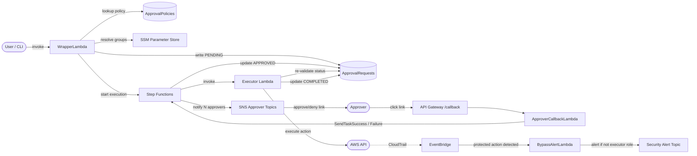
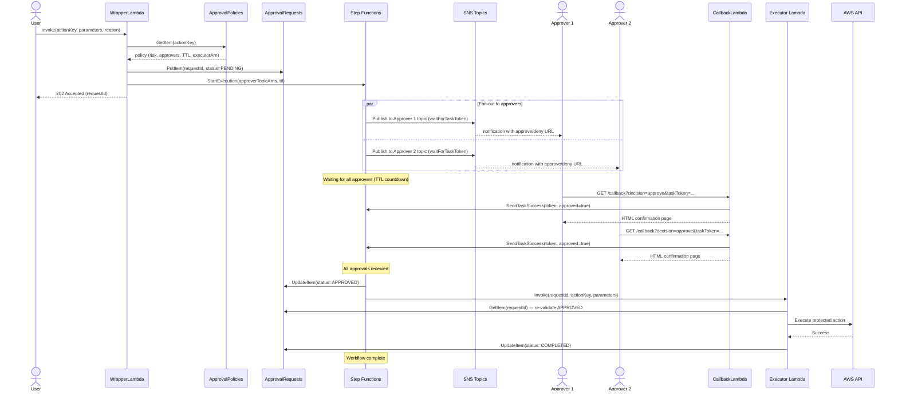

# AWS Approval Gateway

A data-driven, multi-approval, MFA-enforced gateway that intercepts destructive-but-legitimate AWS API calls before they execute. Onboarding a new protected action requires no code changes — only a policy registry entry.

Inspired by the Route 53 deletion guard pattern, extended into a generic gateway.

Reference: [`aws-samples/automating-a-security-incident-with-step-functions`](https://github.com/aws-samples/automating-a-security-incident-with-step-functions)

For a landscape analysis of similar tools and the design rationale behind this architecture, see [docs/DESIGN.md](docs/DESIGN.md).

## Prerequisites

The gateway assumes a properly configured AWS landing zone is already in place. It is not a security baseline — it is an approval workflow for actions that fall between "routine" and "never allowed."

Your landing zone (Control Tower, AFT, or a custom org baseline) must already handle:

- **Audit trail protection** — CloudTrail is org-level, cannot be disabled from member accounts. `cloudtrail:DeleteTrail` and `cloudtrail:StopLogging` are blocked by landing zone SCPs.
- **Config recorder protection** — AWS Config is enforced by landing zone guardrails. `config:DeleteConfigurationRecorder` and `config:StopConfigurationRecorder` are blocked.
- **KMS key protection** — `kms:DisableKey` takes effect immediately with no recovery window and should be blocked by a landing zone SCP. `kms:ScheduleKeyDeletion` has a mandatory 7-30 day waiting period enforced by AWS, during which the deletion can be cancelled. Monitor via CloudTrail alerts or Config rules rather than an approval workflow.
- **Organization integrity** — `organizations:LeaveOrganization` is blocked by landing zone SCPs.
- **Long-lived credential prevention** — `iam:CreateAccessKey` is blocked or monitored by landing zone policies if your org prohibits static credentials.
- **SCP tampering detection** — your landing zone should monitor for `DetachPolicy`, `DeletePolicy`, and `UpdatePolicy` on the Organizations API and alert or auto-remediate. The gateway's SCP is a critical enforcement layer — if it is removed, the gateway's protection is weakened. This monitoring belongs to the management account, not to the gateway.

The gateway does not duplicate these controls. If your landing zone does not cover them, add them to your org-level SCPs before deploying the gateway.

**What the gateway adds on top of the landing zone:** an approval workflow for destructive actions that are sometimes operationally necessary — deleting a hosted zone during a migration, removing an RDS cluster after a data migration, deleting a VPC during decommissioning. These actions are too dangerous to leave open but too legitimate to block unconditionally.

## Enforcement model — IAM deny policy vs SCP

The gateway uses two enforcement layers. They are not interchangeable — they serve different purposes and protect against different threats.

**IAM deny policy** — account-level enforcement. Attached to IAM principals (users, groups, roles) within a single AWS account. Blocks the 6 protected actions for all humans, with an exemption for the gateway's executor role. This is the primary enforcement mechanism and is deployed from within the workload account.

**SCP (Service Control Policy)** — organization-level enforcement. Attached to an OU or account from the AWS Organizations management account. Acts as a ceiling on what any principal in the target accounts can do, regardless of their IAM policies. Account admins cannot remove or modify it. The SCP exempts both the executor role and the `BreakGlassEmergencyRole`.

**Why both are needed:**

| Threat | IAM deny policy alone | SCP alone | Both together |
|---|---|---|---|
| Human calls protected action directly | Blocked | Blocked | Blocked |
| Account admin removes the deny policy | Gateway bypassed | Still blocked by SCP | Blocked |
| Account admin creates a new role without the deny policy | Gateway bypassed | Still blocked by SCP | Blocked |
| Break glass emergency access | No exemption mechanism | `BreakGlassEmergencyRole` exempted | `BreakGlassEmergencyRole` exempted |

The IAM deny policy is the enforcement you control from inside the account. The SCP is the backstop that prevents anyone in the account from undermining it.

**Single-account deployment (no AWS Organization):**

If you are running this in a standalone account with no Organization, SCPs are not available. The gateway still works using only the IAM deny policy, with these limitations:

- There is no protection against an account admin removing the deny policy and calling protected actions directly.
- The `BreakGlassEmergencyRole` exemption only exists in the SCP. In a single-account setup, break glass must be handled differently — for example, by adding the break glass role ARN to the `StringNotLike` condition in the IAM deny policy itself. This is less secure because an account admin could modify that condition.
- There is no SCP tampering detection (that is a management account concern handled by your landing zone).

For production use, an AWS Organization with SCPs is strongly recommended.

## Quick Start

1. Deploy infrastructure (see Deployment Order below)
2. Seed policies: `python scripts/add-policy.py --action-key "route53:DeleteHostedZone" ...`
3. Invoke: `aws lambda invoke --function-name WrapperLambda --payload '{"actionKey": "route53:DeleteHostedZone", ...}'`

## Architecture



## Approval flow

Step-by-step sequence from request submission through execution or rejection.



## Protected actions

The gateway protects destructive-but-legitimate operational actions. These are denied for all human principals via an IAM deny policy and SCP, with an exemption for the gateway's executor role and the `BreakGlassEmergencyRole`.

| Action | Risk | Approvals | Approver groups | TTL | Executor |
|---|---|---|---|---|---|
| `route53:DeleteHostedZone` | CRITICAL | 2 | team-lead, security | 24h | Route53 |
| `iam:DeleteRole` | HIGH | 1 | security | 12h | IAM |
| `rds:DeleteDBCluster` | CRITICAL | 2 | team-lead, data-owner | 48h | RDS |
| `rds:DeleteDBInstance` | CRITICAL | 2 | team-lead, data-owner | 24h | RDS |
| `ec2:DeleteVpc` | CRITICAL | 2 | team-lead, security | 24h | EC2 |
| `s3:DeleteBucket` | HIGH | 2 | team-lead, security | 24h | S3 |

All policies require MFA and send Slack notifications by default. These are seed values in `policies/seed-policies.json` — edit them via `scripts/add-policy.py` or directly in DynamoDB.

The EventBridge bypass detection rule watches for all 7 actions. If anyone calls any of them and they are not the executor role, the BypassAlertLambda fires.

## Break glass — out of scope by design

The `BreakGlassEmergencyRole` is exempted from the SCP, meaning it can bypass the approval workflow for any protected action.

The gateway deliberately does not manage break glass. It does not provision the role, rotate its credentials, gate access to it, or log its usage beyond what CloudTrail captures natively. This is a conscious separation of concerns:

- **The gateway's job** is blocking protected actions and routing them through a structured approval workflow. It owns the deny policies, the approval state machine, the executor Lambdas, and the bypass detection alerts.

- **Break glass is a separate operational concern** owned by your security team. It belongs in a different system — a PAM tool, a sealed credential in AWS Secrets Manager with CloudTrail alerting, an IAM Identity Center permission set with a time-bound session, or whatever your organization uses for emergency access. The gateway should not be the gatekeeper for the most privileged role in your account, because that would make the gateway itself a single point of failure during an emergency.

**What the gateway provides for break glass:**

- The SCP exemption — `BreakGlassEmergencyRole` is listed in the SCP's condition so it is not blocked at the org level.
- Bypass detection — if the break glass role calls any protected action, the BypassAlertLambda fires and publishes the full CloudTrail event to the security alert SNS topic.

**What your security team must own separately:**

- Provisioning and securing the `BreakGlassEmergencyRole` — who can assume it, under what conditions, with what session duration.
- Credential storage — access keys in a sealed envelope, Secrets Manager with rotation, or IAM Identity Center with a time-bound permission set.
- Credential rotation — quarterly at minimum, immediately after any use.
- Usage runbook — when break glass is acceptable, what incident ticket must be filed, who must be notified.
- Quarterly audit — pull CloudTrail logs for the role, verify every use was legitimate and documented, close the loop with the incident ticket.

If break glass is used and no incident ticket exists, that is a security finding regardless of whether the action was operationally justified.

## What is automated

Once deployed, the following happens without human intervention:

- **Policy lookup and workflow orchestration.** The WrapperLambda reads the policy registry, resolves approver groups to SNS topics via SSM, writes the request record, and starts the Step Functions execution. No human touches the routing logic.
- **Fan-out to N approvers.** The Step Functions Map state dynamically fans out to however many approver SNS topics the policy specifies — 1, 2, or 3 — using the same state machine with no changes.
- **Approval collection and state transitions.** Each approver's click hits API Gateway → ApproverCallbackLambda → `SendTaskSuccess`/`SendTaskFailure`. The Map state tracks completion. When all branches resolve, the state machine advances automatically.
- **Status updates in DynamoDB.** PENDING → APPROVED → COMPLETED (or DENIED / EXPIRED / FAILED) — all written by the state machine and executor without manual database edits.
- **Executor invocation and re-validation.** After approval, Step Functions invokes the correct executor Lambda (ARN stored in the policy). The executor re-validates APPROVED status in DynamoDB before calling the AWS API — defense in depth, fully automated.
- **TTL-based expiry.** If approvers don't respond within the policy's `ttlHours`, the Step Functions heartbeat timeout fires, the execution fails, and the DynamoDB record expires via TTL. No cron job or cleanup Lambda needed.
- **Bypass detection.** EventBridge watches CloudTrail for any call to a protected action. The BypassAlertLambda checks whether the caller was the executor role — if not, it publishes a full-context alert to the security SNS topic. This runs continuously with zero human involvement.

## What is not automated — and why

Despite being heavily automated, there are several points where humans are deliberately in the loop, a few more where they're forced in by AWS limitations, and some that recur as operational overhead.

### By design — intentional human gates

These are manual by choice. Removing them defeats the purpose of the gateway.

- **The approval decision itself.** Each approver must read the request — the action, the resource, the requester, the reason — and consciously click approve or deny. This cannot and should not be automated. The whole point is a human making a deliberate, accountable decision. The risk is approval fatigue (rubber-stamping without reading), so notification templates need to surface enough context to force genuine engagement: the resource name, who requested it, the stated reason, and a clear consequence statement.

- **Submitting the request.** A human must invoke the WrapperLambda with an `actionKey`, the target resource parameters, and a `reason`. The reason field is particularly important — it creates an audit record of intent. Requiring a Jira ticket number or change request ID in this field ties the gateway into your change management process.

- **Break glass usage.** The `BreakGlassEmergencyRole` exists for genuine emergencies where the approval workflow is too slow. The gateway does not manage break glass — see "Break glass — out of scope by design" above. Using it must be a fully conscious human decision with an incident ticket created simultaneously.

- **Policy authoring.** Deciding which actions to protect, what risk level to assign, how many approvers are required, and which groups should approve — these are judgment calls that belong to your security team. The gateway enforces whatever policies you configure, but it cannot decide what deserves protection.

### By necessity — AWS platform constraints

These are manual because AWS doesn't offer a better option today.

- **Updating the IAM deny policy and SCP when adding a new action.** The policy registry (DynamoDB) is data-driven, but the IAM deny policy and SCP are static JSON documents. You have to edit and redeploy them every time you add a new protected action. There is no way to make an IAM policy dynamically reference a DynamoDB table. This is the biggest friction point in the "no code deploy required" claim — it holds for the workflow logic, but not for the enforcement layer.

- **Writing a new executor Lambda for a new service.** If you protect an action in a service that has no executor yet, someone has to write it, test it, and deploy it. The `base_executor.py` shared logic reduces this to roughly 10 lines of service-specific code, but it is still a code change and a deployment.

- **Wiring up a new approver group.** If a new team needs to be an approver (e.g. `data-owner` for RDS deletions), someone has to create an SNS topic, add the SSM parameter, subscribe the right people, and test it. This could be partially automated with a setup script but currently is not.

- **SCP deployment requires management account access.** Applying or modifying the SCP must be done from the AWS Organizations management account. This is a privileged operation that usually involves a separate process, a different team, and possibly a change advisory board approval in regulated environments. It is a meaningful deployment gate, not something you can script away.

### Operational overhead — recurring manual work

These are tasks that recur as the gateway runs in production.

- **Alert triage.** Every time the BypassAlertLambda fires, someone has to investigate. Was it a legitimate break-glass use? A misconfigured CI/CD pipeline? An actual attack? Each alert requires human judgment to classify and close.

- **Reviewing expired requests.** When an approval request times out — because approvers were on leave, missed the notification, or the request was abandoned — the DynamoDB record sits as EXPIRED. Someone needs to decide whether to resubmit or discard, and communicate back to the requester.

- **Approver group rotation.** When people join, leave, or change teams, the SSM parameter mapping approver groups to SNS subscriptions needs updating. If this is not done promptly, notifications go to people who have left, or legitimate approvers do not receive them.

- **Break glass operations.** Credential rotation, usage audits, and runbook maintenance for the `BreakGlassEmergencyRole` are ongoing tasks owned by your security team. See "Break glass — out of scope by design" above.

## Worth automating next

Three things stand out as high-value additions:

- **Approver reminders.** A CloudWatch scheduled rule that queries DynamoDB for PENDING requests older than N hours and re-sends the SNS notification. Reduces the expired-request problem significantly without changing the approval model.

- **Policy drift detection.** A Lambda that periodically compares the actions listed in the IAM deny policy and SCP against the ApprovalPolicies registry, and alerts if they have diverged. Catches the scenario where someone adds a registry entry but forgets to update the deny list.

- **Approver group sync from identity provider.** If your company uses Okta, Azure AD, or AWS IAM Identity Center, a sync Lambda can read group membership and update SNS subscriptions automatically. This eliminates the approver rotation maintenance burden almost entirely.

## Deployment Order

Deploy to a sandbox OU first and run the full testing checklist before applying to production.

| Step | Action | Account | Method | Notes |
|---|---|---|---|---|
| 1 | Deploy `ApprovalGatewayStack` | Workload | `cdk deploy` | Creates DynamoDB tables, SNS topics, SSM parameters, IAM roles, Lambda functions, Step Functions, API Gateway, EventBridge rules — all in one stack |
| 2 | Seed the ApprovalPolicies table | Workload | `python scripts/add-policy.py` or bulk load from `policies/seed-policies.json` | Post-deploy step — not part of the CDK stack |
| 3 | Subscribe approvers to SNS topics | Workload | `aws sns subscribe` per approver | Each approver must confirm via email — cannot be automated |
| 4 | Subscribe security team to alert topic | Workload | `aws sns subscribe` on `ApprovalGateway-SecurityAlerts` | For bypass detection notifications |
| 5 | Attach IAM deny policy to human principals | Workload | Manual — attach `infra/iam/deny-policy.json` to all human users, groups, and roles | Account-specific — depends on your IAM topology (Identity Center, federated roles, direct IAM users) |
| 6 | Create and attach SCP | Management | Manual or separate pipeline — create SCP from `infra/iam/scp.json`, attach to target OU | Requires Organizations management account access. Test in sandbox OU first. |
| 7 | Verify end-to-end | Workload | Submit a test approval request, approve it, confirm execution | Validates the full workflow before enabling for real workloads |

**For multi-account deployments:** repeat steps 1-5 for each workload account. Step 6 is done once — a single SCP attached to the OU covers all accounts in it. The `ApprovalGatewayExecutorRole` name must be the same across all accounts (the SCP references it by name pattern).

## Adding a New Protected Action

```bash
python scripts/add-policy.py \
  --action-key "ec2:DeleteVpc" \
  --risk-level CRITICAL \
  --required-approvals 2 \
  --approver-groups "team-lead,security" \
  --ttl-hours 24 \
  --executor-arn "arn:aws:lambda:REGION:ACCOUNT:function:ApprovalGatewayExecutor-EC2"
```

Then add the action to the IAM deny policy and SCP action lists. This second step is manual — see "By necessity" above.

## Security Notes

- Task tokens in approve/deny URLs are single-use and cryptographically bound to the execution
- API Gateway must be HTTPS-only with TLS 1.2 minimum
- Consider WAF rules to allowlist corporate IP ranges on the callback endpoint
- Apply SCP to sandbox OU first, run full testing checklist before production
- Protect the ApprovalPolicies table itself with a deny on `dynamodb:DeleteItem` and `dynamodb:DeleteTable` for that table ARN
- Enable DynamoDB Point-in-Time Recovery on both tables for audit integrity

## TODO — CloudFormation interaction with protected actions

### The problem

When a CloudFormation stack contains a resource protected by the gateway (e.g. an RDS cluster, a VPC, a hosted zone), deleting or updating that stack will fail. CloudFormation attempts the API call (e.g. `rds:DeleteDBCluster`), the IAM deny policy or SCP blocks it with `AccessDenied`, and the resource is marked `DELETE_FAILED`. The stack gets stuck and requires manual intervention.

The same applies to stack updates that trigger resource replacement — CloudFormation deletes the old resource as part of the replacement, and that deletion is blocked.

This is working as intended from the gateway's perspective — the action is protected and should not happen without approval. But the failure is confusing to the person deleting the stack, because CloudFormation's error message is a raw `AccessDenied` with no guidance on what to do next.

### What CloudFormation shows

The `ResourceStatusReason` in the stack events will say something like:

```
API: rds:DeleteDBCluster User: arn:aws:iam::123456789012:role/MyRole is not authorized
to perform: rds:DeleteDBCluster on resource: arn:aws:rds:us-east-1:123456789012:cluster:my-cluster
with an explicit deny in an identity-based policy
```

There is no way to customize this message. CloudFormation does not expose hooks to inject custom error text, annotate stack events, or intercept deletion failures with custom handlers.

### Solution options under consideration

**Option A — Exempt CloudFormation via `aws:CalledVia` condition.** Add a condition to the deny policy and SCP that exempts API calls made through CloudFormation:

```json
"ForAllValues:StringNotEquals": {
  "aws:CalledVia": "cloudformation.amazonaws.com"
}
```

Pros: stack operations work without friction. Cons: anyone who can deploy a CloudFormation stack can bypass the gateway by wrapping a protected API call in a template. Moves the trust boundary from "who can call the API" to "who can deploy a stack." Also, `aws:CalledVia` has edge cases with nested service calls and may not work reliably in all SCP evaluation contexts.

**Option B — Exempt the CloudFormation service role by ARN.** Add the CloudFormation execution role (e.g. `arn:aws:iam::*:role/cdk-*`) to the `StringNotLike` condition alongside the executor role. Same trust boundary concern as Option A, but scoped to a specific role pattern rather than all CloudFormation calls.

**Option C — Real-time notification via existing bypass detection.** Enhance the BypassAlertLambda to detect CloudFormation-initiated failures. When the CloudTrail event has `userAgent: cloudformation.amazonaws.com` and `errorCode: AccessDenied`, publish a different, actionable notification: "CloudFormation tried to delete resource X and was blocked. Submit an approval request to delete it through the gateway, then retry the stack deletion." No new infrastructure needed — just a branch in the existing Lambda. The notification goes to an SNS topic or Slack channel, not into the CloudFormation output itself.

**Option D — Post-failure notification.** An EventBridge rule that watches for CloudFormation `DELETE_FAILED` and `UPDATE_ROLLBACK_FAILED` status changes. A Lambda inspects the stack events, identifies which resource was blocked, and publishes a notification with the resource details and instructions for submitting an approval request. More precise than Option C (it confirms the stack actually failed, not just that an API call was denied) but adds a new Lambda and EventBridge rule.

**Option E — Custom resource wrapper.** Wrap protected resources in a CloudFormation custom resource Lambda. During stack deletion, the custom resource Lambda runs, detects the protected resource, and returns a custom error message. Pros: the error message appears directly in the CloudFormation stack events. Cons: every protected resource in every stack must be wrapped, which is invasive, fragile, and changes how the resource is managed.

### Constraints

- CloudFormation does not allow custom `ResourceStatusReason` text on deletion failures.
- There is no hook to intercept or annotate stack events during deletion.
- The person who triggered the stack deletion is not directly identifiable from the CloudTrail event (CloudFormation's service role is the caller).
- Any exemption for CloudFormation (Options A and B) weakens the gateway's protection model.

### Not yet decided

- Which option (or combination) to implement
- Whether to use a separate SNS topic for operational notifications vs. the existing security alert topic
- Whether to scope this to specific resource types or apply it broadly
